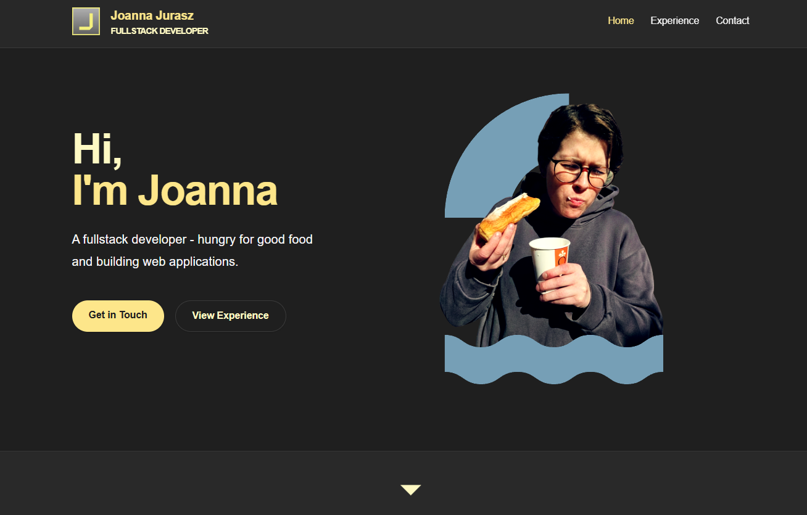

# Joanna Jurasz — Portfolio

A personal portfolio website built with Next.js, showcasing work experience, recommendations, and contact information. Content is managed through a PostgreSQL database, making it easy to update without touching code.

---



---

## Features

- **Home** — hero section, experience preview, recommendations preview, and a technologies grid
- **Experience** — full work history timeline with tech tags, and LinkedIn recommendations
- **Contact** — card-based contact section with email copy (desktop) / mailto (mobile), LinkedIn, and GitHub links

## Tech stack

| Layer     | Choice                                     |
| --------- | ------------------------------------------ |
| Framework | Next.js 16 (App Router, Server Components) |
| Language  | TypeScript                                 |
| Styling   | Tailwind CSS v4                            |
| Database  | PostgreSQL via Supabase                    |
| ORM       | Prisma 7                                   |
| Fonts     | Geist (via `next/font`)                    |

## Getting started

**1. Install dependencies**

```bash
npm install
```

**2. Set up environment variables**

Create a `.env` file in the project root:

```env
DATABASE_URL="postgresql://..."
DIRECT_URL="postgresql://..."
ENV="DEV"
```

**3. Generate the Prisma client**

```bash
npx prisma generate
```

**4. Run the dev server**

```bash
npm run dev
```

Open [http://localhost:3000](http://localhost:3000).

## Available commands

```bash
npm run dev        # Start dev server (Turbopack)
npm run build      # Production build
npm run lint       # ESLint

npx prisma migrate dev    # Apply schema changes
npx prisma studio         # Open database GUI
```

## Database models

| Model            | Description                                                            |
| ---------------- | ---------------------------------------------------------------------- |
| `Profile`        | Singleton row — name, headline, bio, location, email, LinkedIn, GitHub |
| `Experience`     | Work history entries ordered by `orderIndex`                           |
| `Recommendation` | Author, role, company, and quote                                       |

## Project structure

```
src/
├── app/                  # Next.js App Router pages
│   ├── page.tsx          # Home
│   ├── contact/
│   ├── experience/
│   │   ├── work/
│   │   └── recommendations/
│   └── generated/prisma/ # Auto-generated Prisma client
├── components/           # Shared UI components
├── lib/
│   └── db.ts             # Prisma singleton client
└── prisma/
    └── schema.prisma
```
